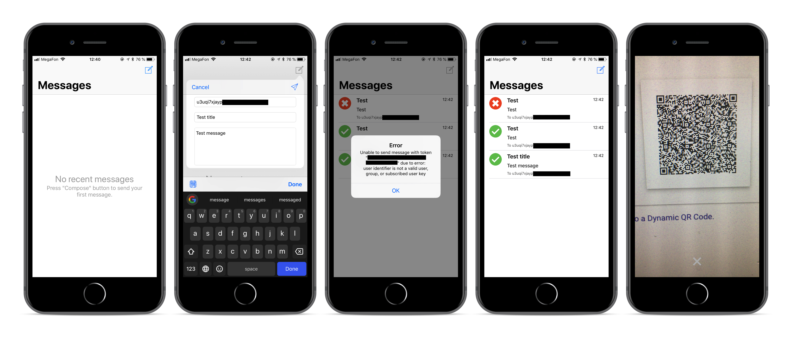

PushoverSender
=======

Send notifications using [Pushover](https://pushover.net/) API.



Requirements
----------------
* iOS 10.0+
* Xcode 9.0+
* Swift 4.0+

Installation
----------------

```
git clone https://github.com/m3g0byt3/pushover-test-task.git\
 && cd pushover-test-task\
  && pod install\
   && open PushoverSender.xcworkspace
```

Author
----------------
[m3g0byt3](https://github.com/m3g0byt3)

License
----------------
Licensed under an [Apache 2.0](https://www.apache.org/licenses/LICENSE-2.0) license. See [LICENSE.md](LICENSE.md) for more information.
